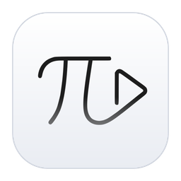

**Pi-Dimension 앱** — [Pi Image (이미지·만화 뷰어)](https://github.com/cherub8128/Pi-Image-Releases) · [Pi Player (동영상·음악 플레이어)](https://github.com/cherub8128/Pi-Player-Releases) · [Pi Zip (압축)](https://github.com/cherub8128/Pi-Zip-release) · [Pi PDF (PDF 편집)](https://github.com/cherub8128/Pi-PDF-releases)

# Pi Player

내 컴퓨터의 동영상과 음악을 모아 보고, 보던 곳에서 이어 재생하세요. 개인·교육·업무용으로 무료입니다.

**[최신 버전 내려받기](https://github.com/cherub8128/Pi-Player-Releases/releases/latest)** · **[Android — Google Play](https://play.google.com/store/apps/details?id=com.PiDimension.PiPlayer.viewer)** · [Pi-Dimension](https://pi-dimension.com/)

이 저장소는 **설치 파일 배포용**입니다. 소스 코드는 공개하지 않습니다.

## 어떤 파일을 받으면 되나요?

| 기기 | 선택할 파일 |
| --- | --- |
| Windows 10·11 (Intel·AMD 64비트) | `windows-x64-setup.exe` 권장 · 설치 없이 쓰려면 `windows-x64-portable.exe` |
| Windows 11 ARM (Snapdragon 등) | `windows-arm64-setup.exe` · `windows-arm64-portable.exe` |
| Apple Silicon Mac (M1 이후) | `mac-arm64.dmg` (또는 `mac-arm64.zip`) |
| Intel Mac | `mac-x64.dmg` (또는 `mac-x64.zip`) |
| Ubuntu·Debian·Mint 등 64비트 | `linux-amd64.deb` |
| Fedora·RHEL·openSUSE 등 64비트 | `linux-x86_64.rpm` |
| 그 밖의 Linux 64비트 | `linux-x86_64.AppImage` — 파일에 실행 권한을 준 뒤 실행 |
| Linux ARM64 (Raspberry Pi 4·5 64비트 OS 등) | `linux-arm64.deb` · `linux-aarch64.rpm` · `linux-arm64.AppImage` |
| **Android 휴대폰·태블릿** | **[Google Play에서 Pi Player 설치](https://play.google.com/store/apps/details?id=com.PiDimension.PiPlayer.viewer)** (APK는 따로 배포하지 않습니다) |

## 주요 기능

- **갤러리** — 폴더 묶음(갤러리)을 여러 개 만들고 사이드바나 Ctrl+1–9로 오갑니다. 갤러리마다 원하는 폴더를 여러 개 지정할 수 있고, 처음 실행하면 사용자 폴더의 동영상 폴더로 "내 동영상" 갤러리를 만들어 두며, 시작할 때 보여 줄 갤러리를 고를 수 있습니다
- **라이브러리** — 하위 폴더까지 동영상·음악을 모읍니다. 이어 보기, 최근 재생, 즐겨찾기, 폴더·태그별 보기, `#태그` 검색, 이름·길이·크기 정렬
- **이어 재생** — 보던 위치를 기억하고 알림에서 "처음부터"를 고를 수 있습니다
- **자막** — SRT·VTT·SMI·ASS, 같은 이름의 자막 자동 불러오기(`영화.ko.srt`도 인식), **한글 인코딩(CP949) 자동 판별**, 싱크 조절, 글꼴 5종(Noto Sans·Pretendard·나눔고딕·Noto Serif·나눔명조 내장)·굵기·색·외곽선·크기·높이
- **재생** — 배속 0.25–4×, 누르고 있는 동안 빨리 감기, 볼륨 200 %, 스마트 볼륨(너무 큰 영상·너무 작은 영상의 전체 소리 크기를 파일마다 맞춤), 구간 반복(A-B), 프레임 이동, 재생 막대 미리보기, 다중 음성 트랙 전환
- **화면** — 맞춤·채우기·원본, 회전, 좌우 반전(댄스·운동 영상 연습), 밝기·대비·채도, 현재 장면 PNG 저장, PiP 작은 화면, 항상 위에
- **재생 방식** — 연속 재생, 목록 반복, 한 편 반복, 한 편만, 무작위
- **파일 연결** — WebM·OGG 동영상과 MP3·FLAC·WAV·OGG·Opus 음악을 더블클릭해 Pi Player로 열 수 있습니다. 이미 열려 있으면 그 창에서 열고 같은 폴더가 재생 목록이 됩니다
- **Wi-Fi 공유** — 같은 Wi-Fi의 휴대폰·태블릿 브라우저에서 QR 코드로 라이브러리를 보고 재생합니다. 재생 위치·즐겨찾기는 PC에 기록됩니다
- **Windows 11 스타일** — 통합 제목 표시줄과 Mica 배경, 작업 표시줄 미리보기의 재생 버튼, 점프 목록, 탐색기 폴더 우클릭 "Pi Player 갤러리에 추가"
- 끌어 놓기, 키보드 단축키(`?`로 목록 보기, 한글 입력 상태에서도 동작), 미디어 키, 다크 모드, 한국어·영어(설치 프로그램 포함)

## 처음 실행할 때

코드 서명 인증서가 없어 운영체제가 확인 안내를 띄울 수 있습니다. 조직의 보안 정책은 우회하지 마세요.

- **Windows** — SmartScreen 창에서 `추가 정보` → `실행`. 사용자 폴더에 설치되며 관리자 권한을 요구하지 않습니다.
- **macOS** — Apple 공증을 받지 않은 ad-hoc 서명입니다. 처음 한 번은 Finder에서 앱을 **우클릭 → 열기**하거나, 시스템 설정 → 개인정보 보호 및 보안에서 `그래도 열기`를 누르세요.
- **Linux** — deb는 `sudo apt install ./Pi-Player-*-linux-amd64.deb`, rpm은 `sudo dnf install ./Pi-Player-*-linux-x86_64.rpm`(ARM64는 파일 이름의 arm64·aarch64판). AppImage는 FUSE가 필요하며, 없으면 `--appimage-extract-and-run`으로 실행할 수 있습니다.

## 파일 연결 (기본 앱으로 쓰기)

- **Windows** — 설치 프로그램이 webm·ogv와 mp3·flac·wav·ogg·opus에 대해 Pi Player를 "연결 프로그램" 후보로 등록합니다. 다른 플레이어의 기본 설정을 바꾸지 않습니다. 기본 앱으로 쓰려면 앱의 **설정 → 일반 → Windows 기본 앱 설정 열기**나 파일 우클릭 → **연결 프로그램 → 다른 앱 선택**에서 Pi Player를 고르고 "항상"을 체크하세요.
- **MP4·MOV·MKV·M4A·AAC는 연결하지 않습니다.** 대부분 H.264·AAC라 처음에는 Pi Player가 운영체제 기본 앱으로 넘기는 파일입니다. H.264·AAC를 직접 추가했다면 "연결 프로그램"에서 Pi Player를 고를 수 있습니다.
- **macOS** — 파일 선택 → `정보 가져오기` → `다음으로 열기`에서 Pi Player → `모두 변경`
- **Linux** — 파일 관리자의 `다른 프로그램으로 열기`에서 Pi Player 선택

## 지원 형식

앱에는 특허 부담이 없는 코덱만 들어 있습니다: **VP8·VP9·AV1·Theora 영상, Opus·Vorbis·FLAC·MP3·WAV 음성**(WebM·MKV·MP4·OGG 등).

**H.264·HEVC 영상과 AAC 음성**(대부분의 MP4·MKV)은 특허 대상이라 Pi Player에 넣지 않았고, 앱이 대신 받아 주지도 않습니다.
이런 파일은 목록에 "기본 앱" 표시가 붙고, 재생하면 **운영체제 기본 앱(Windows 미디어 플레이어·영화 및 TV, macOS QuickTime 등)으로 열기**를
안내합니다. 설정 → 코덱에서 "이런 파일은 바로 기본 앱으로 열기"를 켜면 안내 없이 바로 엽니다. AVI·WMV·AC-3·DTS 등도 같은 방식입니다.
Wi-Fi 공유로 휴대폰에서 볼 때는 휴대폰의 내장 디코더로 재생되므로 H.264도 재생됩니다.

**MP4를 앱 안에서 보려면 — H.264·AAC 직접 추가(선택)**: 설정 → 코덱의 안내대로 Electron 프로젝트의 공식 GitHub 릴리스에서
`electron-v44.4.5-<운영체제>-<CPU>.zip`을 직접 받아 넣으세요(다운로드 폴더에 있으면 앱이 찾아 줍니다). 앱이 공식 파일인지(SHA-256) 확인하고
그 안의 FFmpeg만 꺼내 쓰며, 다시 시작하면 MP4·MKV가 앱 안에서 재생됩니다. 이 파일은 Pi-Dimension이 아니라 Electron 프로젝트가 배포하는 것이고,
파일과 코덱의 이용 조건(특허 포함)은 사용자가 확인해야 합니다. "추가한 코덱 제거"로 언제든 되돌릴 수 있습니다.
설치형에서만 되며(무설치판 제외) macOS에서는 시험 기능입니다. HEVC는 이 파일에도 없어 계속 기본 앱으로 엽니다.

## 개인정보

라이브러리 목록, 재생 기록, 즐겨찾기, 태그, 메모는 이 컴퓨터에만 저장됩니다. 인터넷 연결은 새 버전 확인에만 쓰며(설정에서 끌 수 있음) 버전 번호 외에는 아무것도 보내지 않습니다. 앱은 인터넷에서 영상을 내려받는 기능을 제공하지 않습니다.

## 문제가 생기면

[이슈](https://github.com/cherub8128/Pi-Player-Releases/issues)를 남기거나 support@pi-dimension.com으로 알려 주세요. 운영체제와 버전, 어떤 파일(확장자)에서 생기는지 적어 주시면 빨리 찾을 수 있습니다.

## 이용 안내

개인·교육·회사·기관의 업무용 사용과 조직 내부 설치를 무료로 허용합니다. 앱의 판매·외부 재배포는 제한됩니다. 자세한 조건은 [이용약관](LICENSE.txt), 포함된 오픈소스의 조건은 [라이선스 고지](THIRD_PARTY_NOTICES.md)를 확인하세요. Electron·Chromium의 전체 고지는 설치 폴더의 `LICENSES.chromium.html`에 함께 배포됩니다. 내장 글꼴은 모두 SIL Open Font License 1.1이며 원문은 [licenses](licenses/)에 있습니다. 보안 설계와 점검 결과는 앱 저장소의 보안 문서에 정리되어 있으며, 취약점은 support@pi-dimension.com으로 제보해 주세요.

[Pi-Dimension](https://pi-dimension.com/)

---

## English

Pi Player collects the videos and music on your computer into galleries and resumes where you left off. Free for personal, educational and business use.
**[Download the latest version](https://github.com/cherub8128/Pi-Player-Releases/releases/latest)** · **[Android on Google Play](https://play.google.com/store/apps/details?id=com.PiDimension.PiPlayer.viewer)**

This repository hosts installers only; the source code is not published.

| Device | File |
| --- | --- |
| Windows 10/11, Intel/AMD 64-bit | `windows-x64-setup.exe` (recommended) or `windows-x64-portable.exe` |
| Windows 11 on ARM | `windows-arm64-setup.exe` or `windows-arm64-portable.exe` |
| Apple Silicon Mac | `mac-arm64.dmg` (or `.zip`) |
| Intel Mac | `mac-x64.dmg` (or `.zip`) |
| Ubuntu/Debian/Mint, 64-bit | `linux-amd64.deb` |
| Fedora/RHEL/openSUSE, 64-bit | `linux-x86_64.rpm` |
| Other Linux, 64-bit | `linux-x86_64.AppImage` (make it executable first) |
| Linux on ARM64 (e.g. Raspberry Pi 4/5, 64-bit OS) | `linux-arm64.deb`, `linux-aarch64.rpm` or `linux-arm64.AppImage` |
| Android | [Pi Player on Google Play](https://play.google.com/store/apps/details?id=com.PiDimension.PiPlayer.viewer) (no APK is published) |

**Features** — galleries (each a set of any number of folders; switch in the sidebar or with Ctrl+1–9; the first start creates "My Videos" from your Videos folder), resume, favorites, tags and notes, SRT/VTT/SMI/ASS subtitles with Korean encoding detection and five bundled subtitle fonts, speed 0.25–4×, smart volume (evens out overall loudness from file to file), A-B repeat, frame stepping, picture adjustments, snapshots, picture-in-picture, Wi-Fi sharing to phones and tablets, Windows 11 styling (Mica, taskbar buttons, jump list, Explorer "Add to Pi Player gallery"), keyboard shortcuts (`?`), dark mode, Korean and English (including the installer).

**Formats** — only patent-free codecs are included: VP8, VP9, AV1, Theora video and Opus, Vorbis, FLAC, MP3, WAV audio. **H.264, HEVC and AAC** (most MP4 and MKV files) are patent-encumbered, so Pi Player neither includes nor downloads them; those files open in your operating system's default player (optionally at once, in Settings → Codecs). To play them in the app, you can add H.264 and AAC yourself: download Electron's official `electron-v44.4.5-<os>-<arch>.zip` from the Electron GitHub release and give it to Pi Player (Settings → Codecs), which checks its SHA-256 and uses only the FFmpeg library inside. That file comes from the Electron project, and its terms (including patents) are yours to check; installer builds only, experimental on macOS, HEVC not included. For the same reason the installer does not register Pi Player for MP4, MOV, MKV, M4A or AAC.

**First start** — there is no code-signing certificate yet. Windows: SmartScreen → *More info* → *Run anyway* (installs per user, no admin rights). macOS: right-click the app → *Open* once. Linux: `sudo apt install ./Pi-Player-*-linux-amd64.deb`, `sudo dnf install ./Pi-Player-*-linux-x86_64.rpm`, or run the AppImage (needs FUSE).

**Privacy** — your library, history, favorites, tags and notes stay on this computer. The internet is used only to check for a new version (can be turned off), sending nothing but the version number.

**Terms** — [license](LICENSE.txt) (Korean) and [third-party notices](THIRD_PARTY_NOTICES.md). Report problems in [Issues](https://github.com/cherub8128/Pi-Player-Releases/issues) or to support@pi-dimension.com.
